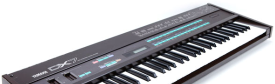

# Welcome to Silicon Soundscapes : Tulia 

## FPGA Synthesisers: An Old Engineer's New Adventure

After spending almost four decades elbow-deep in embedded systems, watching the industry evolve from simple 8-bit microcontrollers to today's complex SoCs, I've decided it's time for a new challenge. 

Rather than settling into a quiet semi-retirement, I've found myself drawn into the fascinating world of FPGA-based audio synthesis - a perfect fusion of my engineering career and my parallel life as a musician.

## Where Engineering Meets Music

My journey with synthesizers began long before I started working with embedded systems. In the 1980s, I was performing with synthesizers during what many consider the golden age of electronic music. 

Those hands-on experiences with legendary instruments like the Yamaha DX7, Roland Juno-106, Yahama CS20M and others didn't just make me a better musician - they gave me a deep appreciation for the intricate relationship between technology and musical expression.

Now, after years of engineering various embedded systems by day while continuing to explore electronic music by night, I'm finally in a position to bridge these two worlds. 

The prospect of designing my own FM synthesizer isn't just an engineering challenge - it's an opportunity to apply decades of both technical knowledge and musical intuition and to share my journey with others.

## Why FPGAs and Why Now?

The journey from traditional embedded systems to FPGAs feels natural to me. Throughout my career, I've often bumped up against the limitations of fixed-architecture processors, particularly when dealing with real-time systems. 

FPGAs offer something different - a blank canvas where we can implement true parallel processing and create dedicated hardware structures for our specific needs.

Having spent countless hours programming patches on hardware synthesizers and then years programming embedded audio devices, I understand both the musician's perspective and the engineer's challenge. 

There's something poetic about using FPGAs to recreate and potentially enhance the digital synthesis techniques I first encountered as a performing musician decades ago.

## The Digilent CMOD-A7: A Perfect Starting Point

I chose the Digilent CMOD-A7 as my development platform for several reasons. It's affordable, well-documented, and offers enough resources to create many capable  synthesizers while maintaining a level of constraint that forces good design practices. 

Plus, its compact form factor is more familiar to me, reminding me of the microcontroller development boards I've worked with throughout my career.

Of course, this project will work equally well on any board that hosts a Xilinx (AMD) 7 Series FPGA of equivalent (or better) capability.  Indeed, I started this project on a Digilent Arty-Z7 Zynq board while waiting for the CMOD-A7 to arrive.

## What to Expect from This Series

Over the coming months, I'll be sharing my journey of developing an FM (more correctly PM) synthesizer on the CMOD-A7. 

We'll cover everything from basic FPGA concepts to the intricacies of implementing digital oscillators and FM operators. 

This series is aimed at makers and hobbyists, and perhaps engineers who, like me, might have extensive experience in traditional embedded systems but are looking to explore the world of FPGAs.  

Musicians interested in the technical side of synthesis will also find plenty to digest here.

### Here's what we'll be covering:

1. Setting up the development environment and basic FPGA concepts
2. Implementing a direct digital synthesizer (DDS)
3. Building FM operators and understanding the math behind FM synthesis
4. Creating a musical envelope generator (with insights from classic synthesizers)
5. Developing a performance-oriented control interface
6. Adding effects and modulation capabilities inspired by vintage synthesizers

I'll be approaching these topics from the dual perspective of an engineer and musician. 

Expect plenty of practical tips, hard-learned lessons from both disciplines, and perhaps a few war stories from both the engineering trenches and the synthesizer performance days.

### Getting Started: What You'll Need
Before we dive into building our synthesizer, let me share what background knowledge will help you get the most out of this series. Don't worry if you're not an expert in all areas - curiosity and willingness to learn are your most important assets!

### Helpful Background Knowledge

- Experience with C/C++ embedded programming
- Basic familiarity with SystemVerilog HDL
- Fundamental digital audio concepts
- General understanding of synthesis and MIDI

### About SystemVerilog
I've chosen to focus this series on building our synthesizer rather than teaching SystemVerilog basics. This lets us spend more time on the exciting parts: creating digital audio systems and designing reusable FPGA components. If you're new to SystemVerilog, there are many excellent resources available online and in print that can help you build the foundation we'll use here.

### What's Expected
You'll find it helpful to know:

- Basic HDL concepts (modules, ports, signals)
- Common SystemVerilog constructs (always blocks, type declarations)
- How to navigate Vivado and Vitis tools

### What's Not Required
Don't worry if you're not familiar with:

- Advanced SystemVerilog features
- FPGA optimization techniques
- Audio DSP algorithms
- Real-time system design

We'll explore these topics together as we build our synthesizer!

## Why Follow Along?
Whether you're an experienced engineer looking to branch out, a musician interested in the technical side of synthesis, or someone curious about FPGAs, this series will offer a practical, hands-on approach to digital synthesis. 

I'll share not just the successes, but also the false starts, dead ends and mistakes - because that's often where the real learning happens.

We'll start simple and add more advanced optimisations, such as Time Division Multiplexing (TMD) and pipe-lining as we go along.  Building from a single sine oscillator to a fully fledged, 12 voice, 4-operator FM instrument.

The beauty of FPGAs is that they let us create true hardware implementations of our ideas. We're not just writing software that runs on a processor; we're designing the processor itself, tailored specifically to our needs. 

For anyone who's ever fought with CPU cycles or interrupt latency while trying to generate audio, this is a liberating, if challenging, experience.

## What's with the Name, Tulia?
No reason.  I just choose to name my audio projects with those used by Ancient Romans. 

Tulia was the daughter of the Roman statesman Marcus Tulius Cicero.  Daughters typically took a feminine form of their fathers middle name (nomen gentilicium) which indicated the father's gens, a partriachal family line. So, Tulia from Tulius.  Julia, from Gaius Julius Caesar is another famous example still in common use today.  

And with that, I shall spare you any further lectures on Ancient Roman history, another interest of mine.

You can, of course, use whatever name you like.

## About My Hardware Design Skills

While I've spent decades in embedded systems engineering, I approach FPGA design more like a jazz musician dabbling with classical piano - enthusiastic but occasionally hitting bum notes. 

Professional FPGA designers will spot places where my design choices resemble using a screwdriver to hammer in a nail - functional, but not quite orthodox.

You find me now, armed with determination and just enough knowledge to be dangerous. I looked at an FPGA and thought "How hard could it be?" (Narrator: It was harder than he thought.)

This series documents my journey from bit-banging microcontrollers to wrestling with hardware description languages. 

If you're a professional FPGA designer, feel free to treat this as a form of engineering comedy - just remember, we embedded folks are trying our best with our software hammers in this rapidly growing hardware world. 

And hey, if it works, it works... right?

(Professional FPGA designers, I promise the code will eventually synthesize. Most of it. Probably.)

## Let's Get Crackin'

So lets get going on the series, we'll start to get our development environment set up and create our first simple sine wave generator. Tulia, like every synthesizer has to start somewhere!
