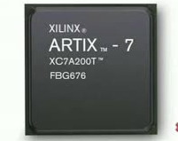
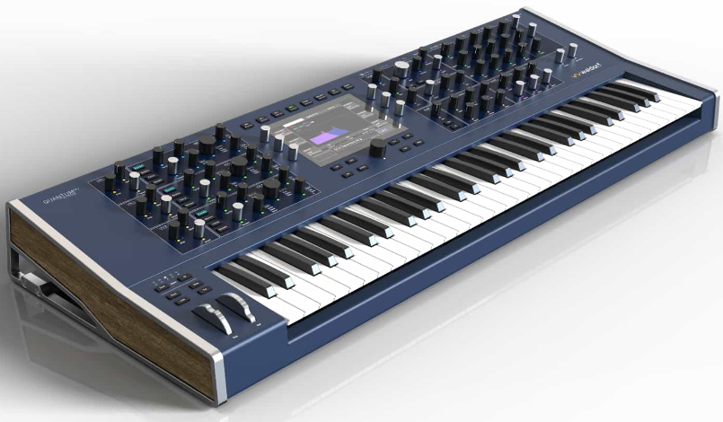
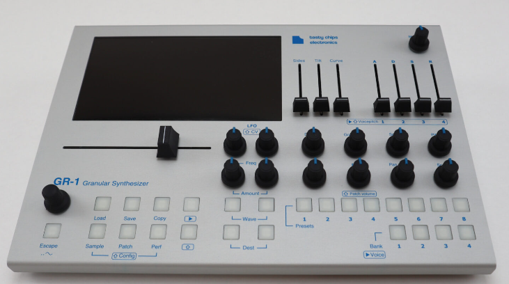

# Introduction to FPGA Audio

Envisage yourself working at a modern hardware synthesiser.  You change a control and milliseconds later the instrument responds with no perceptible delay between gesture and sound, just instantaneous music expression.  This is the magic of hardware-based synthesis, and with an FPGA we can create this same magic from the ground up.

While software synthesisers running on the very powerful general purpose processors found on laptops today can equal this kind of performance, many of us who perform live are cautious about using them, an unexpected update or crash in the middle of a performance is a jarring experience for both artist and audience!

Field Programmable Gate Arrays (FPGAs) represent a sweet spot in digital audio processing that many makers overlook. 

As programmable sillicon, they offer some of the flexibility of software with the performance of dedicated hardware, making them ideal for building custom audio instruments. 

While microcontrollers and CPUs process audio samples one at a time, FPGAs can handle multiple audio streams simultaneously, with sample accurate,  precise, deterministic timing that musicians can rely on.

In this section, we'll begin our journey toward building Tullia, a fully-featured FM synthesizer implemented entirely in digital hardware. But before we dive into frequency modulation and oscillator matrices, we need to understand the fundamental concepts of audio processing on FPGAs. Why does parallel hardware matter for audio? How do we represent sound in digital logic? What architectural patterns help us build complex audio systems?

Think of this chapter as laying the foundation for your workshop. Just as you wouldn't start building a guitar without understanding wood grain and resonance, we'll first explore how FPGAs can shape and manipulate digital audio. We'll examine real-world examples, from professional audio interfaces to stage-ready synthesizers, all built on the same principles you're about to learn.

The techniques we'll cover aren't just theoretical – they're the same approaches used in professional audio equipment. 

## Learning Objectives

In this section we will touch, albeit fairly lightly on the following learning objectives:

- Discuss the advantages of FPGAs for audio processing.
- Compare FPGAs vs traditional processors for audio applications.
- Introduce audio sampling concepts.
- Touch on why FPGAs are becoming more widely used for audio.

### Why use FPGAs for Audio Processing?

When it comes to real-time audio processing, hardware implementation offers distinct advantages that software solutions struggle to match. Let's explore why FPGAs represent an ideal platform for audio applications, especially for synthesisers like Tullia.

#### Deterministic Timing and Latency

In the world of digital audio, timing is everything. FPGAs excel here by providing guaranteed, sample-accurate processing that remains consistent regardless of system complexity. 

Unlike CPU-based systems, where background processes or interrupt handlers can introduce unpredictable delays, FPGA designs operate with clockwork precision. 

Every sample is processed within its designated time window – at 48kHz, that's exactly 20.8 microseconds per sample, every time, without fail.

This deterministic behavior translates directly into ultra-low latency capabilities. 

While CPU-based audio systems typically require substantial buffer sizes – often 128 to 512 samples (2.6 to 10.6 milliseconds at 48kHz) – to ensure smooth operation, FPGA designs can operate with minimal buffering. 

Tullia will achieve input-to-output latencies as low as 1-2 samples (20-40 microseconds), making it feel instantaneous to the performer. This is particularly crucial for live performance where every millisecond of delay between pressing a key and hearing the note can impact playability.

#### Parallel Processing Capabilities

Perhaps the most compelling advantage of FPGAs for audio applications lies in their ability to process multiple audio streams simultaneously. 

Consider a 16-voice polyphonic synthesizer: In a CPU implementation, the processor must time-slice between voices, calculating each one in sequence. Even with a powerful processor, this sequential processing introduces complexity and potential timing issues. 

In contrast, our FPGA implementation processes all 16 voices truly in parallel – each voice computed simultaneously, by its own hardware circuit, within the same 20.8-microsecond window.

#### Direct Hardware Interfaces

The ability to interface directly with audio hardware eliminates several layers of complexity present in CPU-based systems. 

Wher a computer might need to traverse USB protocols, driver stacks, and operating system layers to process audio, our FPGA connects directly to audio CODECs through an I2S interface. MIDI input receives similar treatment – instead of dealing with USB-MIDI interfaces and driver stacks, we implement a direct UART connection that processes MIDI data with sub-microsecond timing precision.

This direct hardware approach extends to clock management. 

Through careful use of PLLs and clock distribution networks, we can achieve sample-accurate synchronization between all interfaces with measured jitter often below 1 nanosecond. This precise timing control is crucial for maintaining audio quality and ensuring reliable operation across all system components.

#### Implementation Advantages

The direct hardware implementation of audio algorithms provides significant advantages in processing efficiency. Operations that might require dozens of CPU cycles can be completed in a single clock cycle on an FPGA. 

Tullia's operator pipeline, for instance, completes phase accumulation in one cycle, sine lookup in two cycles, and envelope calculation in one cycle, for a total operator latency of just 4-5 clock cycles.

This efficiency translates into impressive real-world performance metrics.

#### Development and Evolution

FPGA development offers unique advantages during both initial development and long-term maintenance. The ability to probe signals at any point in the design without affecting audio processing enables thorough debugging and optimization. Hardware-in-the-loop testing allows real-time parameter adjustment without recompilation, making it possible to fine-tune the synthesizer's sound while it's running.

The platform also provides excellent future-proofing capabilities. New features can be added without impacting existing functionality, and the entire system can be updated in the field through simple bitstream loading. This flexibility ensures that the synthesizer can evolve over time, incorporating new capabilities while maintaining backward compatibility.

### Digital Audio Fundamentals

We won't be digging deeply into the theory behind digital audio, there are plenty of online references and books that will provide a better detailed explanation than any I can provide here.  See Appendix D for some suggested reading.

We do, however, need a basic understanding of some fundamentals in order to make sense of the rest of this project.

#### Understanding Digital Audio

At its core, digital audio is about capturing continuous sound waves and representing them as a series of discrete numerical values. 

Imagine taking a photograph of a moving object – just as a photo captures an instant in time, digital audio captures snapshots of sound pressure levels many thousands of times per second. These snapshots, or samples, when played back in rapid succession, recreate the original sound, much the same way as individual frames, pictures, in a film when played back in rapid succession produce a moving picture.

The quality and accuracy of this digital representation depend on two fundamental parameters: sample rate and bit depth. 

#### Sample Rate

Sample rate tells us how frequently we take these snapshots, measured in samples per second (Hz). Common sample rates include 44.1kHz (CD quality) and 48kHz (professional audio), meaning we capture 44,100 or 48,000 samples every second. The choice isn't arbitrary – it's based on the Nyquist sampling theorem, which states that to accurately reproduce a sound, we need to sample at more than twice the highest frequency we want to capture. 

Since human hearing extends to roughly 20kHz, our 48kHz sample rate comfortably covers the entire audible spectrum.

However, digital audio isn't without its pitfalls. When we sample or generate sounds containing frequencies above half our sample rate (the Nyquist frequency), these higher frequencies can "fold back" into the audible range, creating unpleasant artifacts called aliasing. 

This cannot simply be filtered out as they are now in the same range as the audio we want.  In any synthesizer design, we need to ensure our generated frequencies don't exceed the Nyquist limit, or implement anti-aliasing measures if they do.

#### Digital Resolution

Bit depth determines how precisely we can represent each sample's amplitude. Again, think of it like the resolution of a digital photo – more pixels generally mean a clearer picture. 

In audio, more bits mean we can represent the sound level more accurately. 

Most professional audio systems use 24-bit samples, providing roughly 144dB of dynamic range – far exceeding what our ears can perceive. 

This headroom is valuable for internal calculations, helping to prevent degradation as we process the audio. When we capture or generate a sample, we're essentially rounding the actual sound level to the nearest value we can represent with our chosen bit depth. 

This rounding introduces quantization noise – a subtle degradation of the signal. 

While 16-bit audio (CD quality) has audible quantization noise in very quiet passages, 24-bit virtually eliminates this concern for practical purposes.  

### Why the Industry is adopting FPGAs

Companies like RME, Universal Audio, and MOTU rely on FPGAs for their flagship products – and with good reason. The RME Fireface UFX+ can process 94 channels of audio with sub-millisecond latency while running complex DSP effects, a feat that would overwhelm even high-end CPUs. 

Antelope Audio's Galaxy 384 takes this further, implementing their entire processing chain in FPGA fabric to achieve a staggering 384kHz sample rate across 64 channels.

In the synthesizer world, the advantages of FPGAs are even more pronounced. 

Waldorf's Quantum synthesizer takes advantage of FPGA parallel processing to offer three different synthesis types simultaneously – wavetable, granular, and resonator – with each voice having dedicated hardware resources and zero latency between parameter changes and sound output. 

Boutique manufacturers like Tasty Chips Electronics use FPGAs in their GR-1 granular synthesizer to manipulate thousands of audio grains in parallel, creating textures that would be impossible with traditional processors.

These companies all use FPGAs because they're the only technology that can deliver this kind of synthesis with the deterministic timing and parallel computation their instruments need. 

When we build Tullia, while we won't have the fancy enclosures,  we'll still be using the same fundamental techniques that power these polished, professional instruments.