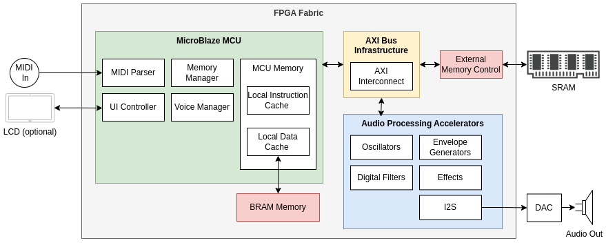
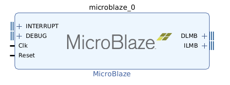
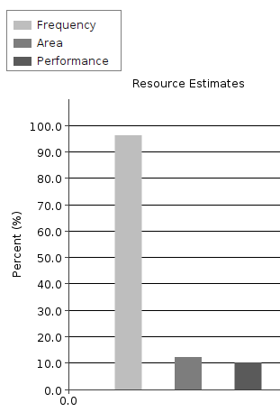

# Hybrid Hardware Architecture: When MCUs Meet FPGAs

Ever found yourself torn between using a microcontroller or an FPGA for your project? Well, who says you can't have both? Let's dive into how we're architecting our audio processing platform to leverage the best of both worlds.

### The Plot Twist
If you've been following along, you might be thinking: "Hold up – weren't we supposed to be using an FPGA for this project?"

You're right, but here's where it gets interesting: we're actually going to use both an FPGA and a MicroBlaze MCU. Before you raise an eyebrow, let me explain why this hybrid approach makes perfect sense.

### Why MicroBlaze?

The MicroBlaze (our chosen soft-core processor) shares many characteristics with traditional MCUs, making it perfect for handling control-heavy tasks. Think of it as the project manager of our system – great at making decisions and coordinating various components.

MicroBlaze was created by AMD specifically for use with their FPGAs and is highly optimal for this purpose.

The primary functions that our MicroBlaze will handle are:

- MIDI Parsing: Processing incoming MIDI messages, interpreting control changes, and managing timing
- User Interface Processing: Handling button presses, encoder inputs, and display updates
- Voice Management: Allocating and deallocating voices, managing priorities
- Memory Management: Coordinating access to shared resources and managing sample storage

These tasks have something in common: they involve complex decision trees and sequential operations that aren't well-suited for parallel processing. For example, MIDI parsing requires interpreting a stream of bytes according to the MIDI specification – a task that's much more straightforward in sequential code than in hardware logic.

### Enter the FPGA

While the MicroBlaze handles the control plane, our FPGA fabric will be doing the heavy lifting for audio processing. This is where parallelism really shines. We'll implement functions like:

- Digital filters
- Envelope generators
- Oscillators
- Effects processing

Each of these blocks can run independently and simultaneously, taking full advantage of the FPGA's parallel nature.

### The Bridge: AXI Interfaces
To make this hybrid architecture work, we need a robust communication mechanism between our MCU and FPGA logic. This is where AXI (Advanced eXtensible Interface) comes in. AXI is part of the ARM AMBA family of microcontroller buses but is widely used in FPGA designs.

### Hardware Acceleration: The Best of Both Worlds

This pattern of enhancing an MCU with custom hardware is known as hardware acceleration, and it's more common than you might think. You'll find similar architectures in:

Modern smartphones (main processor + neural processing unit)
Graphics cards (CPU + GPU)
Network interface cards (host CPU + network processor)

In our case, we're using this pattern to create an audio processing platform that combines the ease of programming an MCU with the processing power of custom FPGA logic.

Many higher-end FPGAs have hardware processors implemented on the same die as the FPGA fabric. The Artix 7 FPGA that we are using does not have a hardware processor so we will be implementing a softcore processor, MicroBlaze, in the FPGA fabric itself.
### The Big Picture

Our architecture demonstrates a clear separation of concerns between three main subsystems:

#### MicroBlaze MCU Domain

- Handles control-flow heavy tasks like MIDI parsing and UI management
- Uses local memory (BRAM) for caching data and instructions.
- Uses external memory for storing program and data.
- Runs at 100Mhz.

#### Hardware Accelerator Domain

- Implements parallel audio processing blocks
= Each block (filters, envelopes, oscillators) operates independently
- Can process multiple audio streams simultaneously
- Runs at 200MHz
- Optimized for specific DSP operations

#### AXI Bus Infrastructure

Acts as the communication backbone of the system.  AXI interconnect allows components in each of the domains to communicate directly with each other via AXI ports.

#### Memory Architecture

The system's memory architecture is designed to balance performance with cost-effectiveness. 

The Microcontroller (MCU) primarily relies on external memory, which offers larger capacity at a lower cost. While this external memory is slower, requiring dozens of cycles per access through the AXI interface, the MCU compensates by using a small  block RAM cache to store frequently accessed instructions and data, thereby improving overall performance.

In contrast, the Audio Processing Accelerators exclusively use block RAM (BRAM). Though BRAM has limited capacity, it is part of the FPGA fabric and so provides very fast access speeds (1-2 clock cycles), making it ideal for time-critical operations like lookup tables and delay lines. 

This dual approach—using external memory for bulk storage and BRAM for speed-critical components—creates an efficient balance between performance, cost, and functionality.

# Creating the MicroBlaze Hardware Platform

MicroBlaze is a highly configurable soft-core processor implemented using FPGA logic resources. 

It features a 32-bit Reduced Instruction Set Computing (RISC) architecture with a Harvard memory configuration, separating instruction and data access paths. 

The processor employs a 3-stage or 5-stage pipeline depending on configuration, allowing for optimization between performance and resource utilization.

MicroBlaze provides 3 starting configurations on which to base a design:

- Microcontroller
- RealTime Processor
- Application Processor

We will be using the Microcontroller preset as our starting point, this is the least performant, implementing a 3-stage pipeline, but occupies the smallest count of logic elements.  Given that the FPGA we're using has a modest number of logic elements, space is our main constraint.

Beyond this we can also configure other details of the processor.

In addition to the preset, we will be enabling:

- Hardware support for integer divide/multiply.  
- Barrel Shifter
- AXI Instruction and Data caches

## The Vivado Project

Start Vivado and open the project we created earlier in the [Development Environment and Tools ](devtools.md) section.  If you didn't complete this step earlier, then go and do so now before continuing.

### Step 1: Create and Configure MicroBlaze

{: .tip}
> There are many steps in this workflow that could be automated using "Designer Assistance" featured in Vivado.  This tool (the green bar that pops-up at the top of the design) helps configure and connect the design, adding other components as required.  This tool provides a great productivity gain but for the moment we will do things manually to get familiar with the process.

We are going to create a block design.  The Vivado block design lets us visually design a platform by adding and connecting components (called IP cores) of various kinds.  It is a common pattern top-level designs to be implemented this way.

In the Flow Navigator pane on the left:

    -  Click on "Create Block Design" 
    -  Change the design name to "system" and leave the other fields unchanged.  
    -  Click OK to create the block design.

Add the MicroBlaze processor:

    - Click the + button and search for MicroBlaze in the IP catalogue.
    - Select the "MicroBlaze" entry, the first in the list.  This will add the block to the design

    - Double-click the MicroBlaze component to open the customisation dialog:

  The customisation dialog has multiple pages and we'll be making changes on several of them.  This paged "wizard" approach is common for many of the IP cores that we'll use.

  Observe the useful resource estimates graph on the left.  Right now MicroBlaze is using around 10% of the FPGA area (logic elements) and performance is very low, at 10% of MicroBlaze maximum.  Keep an eye on this graph as we make the various configuration changes.

  

Configure the MicroBlaze processor:

    - Change the configuration dropdown to "Microcontroller Preset"
    - Check "Use Instruction and Data Caches"
    - Click Next
    - Check "Enable Integer Divider"
    - Click Next

If you look at the graph now you'll notice that the area and performance have gone up, and the frequency has decreased.  A high CPU is important in the PC world so is this a bad thing?

While the clock frequency has decreased, this actually reflects the more sophisticated processor design. 

Think of it like this: Before our changes, each clock cycle could only accomplish simple operations. The higher clock frequency was needed because it took multiple cycles to complete complex tasks like multiplication and division.

Now, though running at a lower frequency, each clock cycle accomplishes much more work thanks to hardware features like dedicated multipliers, changes, and other improved pipeline handling. 

The frequency reduction is necessary because these more complex hardware operations need more time to complete within a single clock cycle - but the processor accomplishes far more work per cycle than before.

